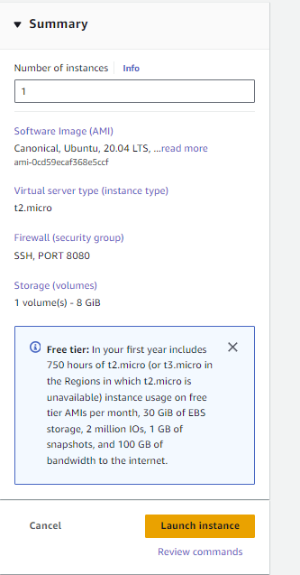
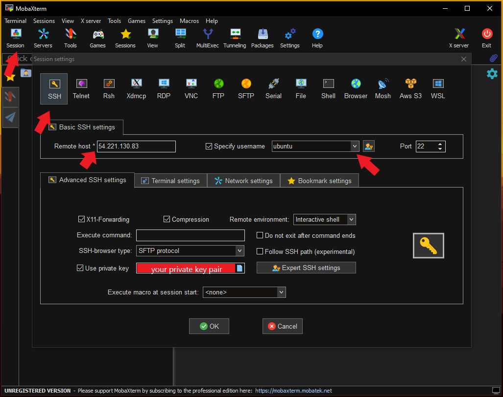

# APACHE TOMCAT HANDS-ON PROJECT


The significance of hands-on experience with Apache Tomcat cannot be overstated. By gaining proficiency in deploying, configuring, and maintaining Tomcat, developers and system administrators acquire valuable skills that are essential for the successful deployment and management of web applications. Understanding Tomcat's architecture and functionality enables professionals to optimize performance, troubleshoot issues effectively, and implement security measures to safeguard the web application and its data.


# APACHE TOMCAT

Tomcat, officially known as Apache Tomcat, is an open-source web server and servlet container developed by the Apache Software Foundation. It's designed to execute Java servlets and render JavaServer Pages (JSPs) for dynamic web applications.


# Featres of Tomcat

- Open Source: Tomcat is released under the Apache License, making it free to use and distribute.

- Servlet Container: Tomcat functions as a servlet container, allowing developers to deploy and run Java servlets and JavaServer Pages (JSPs) for dynamic web applications.

- Cross-Platform: Tomcat is platform-independent, meaning it can run on various operating systems such as Windows, Linux, macOS, etc.

- Embeddable: Tomcat can be embedded within other applications, allowing developers to integrate servlet and JSP processing into their own Java applications.

- Scalability: Tomcat can handle a large number of concurrent connections and is scalable to meet the demands of growing web applications.

- HTTP Server: Tomcat includes an HTTP server component, allowing it to serve static content as well as dynamic content generated by servlets and JSPs.

- Modular Architecture: Tomcat's modular architecture allows for easy customization and extension through the use of additional components and plugins.

- Security Features: Tomcat provides various security features such as SSL/TLS support, access controls, and authentication mechanisms to secure web applications.

- Clustering Support: Tomcat supports clustering, allowing multiple Tomcat instances to work together to distribute the load and provide high availability and fault tolerance.

- Management and Monitoring: Tomcat provides tools for managing and monitoring the server, including a web-based administration interface and logging capabilities for tracking server activity.


# WHAT TO EXPECT AFTER ACCOMLISHING THE PROJECT 

- `Successful Source Code Integration:` You successfully integrated source code from a remote repository, demonstrating proficiency with version control systems like Git and showcasing your ability to seamlessly incorporate new features and updates into the project.

- `Proficient Server Setup: ` You provisioned and configured Maven, Apache, and Java on an Ubuntu server hosted on AWS, showcasing your expertise in server provisioning and configuration management. This process allowed you to set up essential development tools and runtime environments effectively.

- `Effective Configuration Management:` Through configuring Apache Tomcat and other components, you demonstrated your capability in managing software configurations to meet the requirements of the e-commerce website. Your efforts ensured that the configurations aligned with project specifications and contributed to its smooth operation.

- `Successful Deployment:` You orchestrated the deployment process, from setting up the server environment to deploying the application on an AWS server. This accomplishment highlights your ability to manage deployment workflows and ensure the accessibility of the website to users.

- `Hands-On AWS Experience:` By deploying the website on an AWS server, you gained practical experience in cloud infrastructure management. This experience involved provisioning resources, configuring security settings, and leveraging AWS services to host and scale web applications effectively.

# STEPS

# Step 1: Create an Ubuntu Machine on AWS 

- We will launch an ubuntu instance with following details; 

    - AMI: Ubuntu Server 20.04 LTS (HVM), SSD Volume Type
    - Instance Type: t2.micro
    - Volume: 8 GB
    - Security Group: SSH (22), HTTP(8080)




# Step 2: Remotely access the Ubuntu machine with MobaXterm 

- I use MobaXterm for remote access to my remote machine you can always use other options such as VSCODE. 

- Open your MobaXterm app on your local computer go to `Session` icon on the top menu. 
- Choose `SSH` and for remote host: write your `Public IP of your ec2 instance`
- Choose the `Specify username` write `ubuntu` (if you write other names you get an error. )
- From `Advanced SSH Setting` make sure you upload your `Key-Pair` by selecting`Use private key` and clicking `blue folder icon`




# Step 3 : Install Apache, Maven and Java 

# Apache Tomcat Server Installation

- First we need to go inside the `opt` folder with `cd` command. 

```bash
cd /opt
```

Note: *The /opt directory in Linux is typically used for installing additional software packages that are not part of the operating system's default installation. It stands for "optional" and is often used by software vendors to install their applications.*

- Here's a simple example of how software installed in /opt might look:

```
/opt/myapp
    ├── bin
    │   └── myapp
    ├── lib
    ├── share
    │   └── doc
    │       └── myapp
    └── README
```


- We need to install Apache Tomcat with following bash command; 

```bash
sudo wget https://archive.apache.org/dist/tomcat/tomcat-9/v9.0.65/bin/apache-tomcat-9.0.65.tar.gz
```

- Let's breakdown the code for better understanding.

    - `sudo:` It stands for "superuser do", it allows the user to execute the command with superuser (or root) privileges.
    - `wget:` This is a command-line utility for downloading files from *the web* (URL). It retrieves content from web servers and saves it to a specified file or directory on your local system.
    - `URL:` It is the address where the tomcat server binary with version of 9.0.65 is located. 


- You can see the file with `ls` command. 


- As you can see above image, it is a zip file which we need to extract it. 

```bash
sudo tar -xvf apache-tomcat-9.0.65.tar.gz
```

- Let's breakdown the code for better understanding.
    - `tar:` This is a command-line utility in Unix and Linux operating systems used to manipulate archives (Tape ARchives). It can create, list, extract, and modify archives. In this case, it's being used to extract the contents of the archive.
    - `-x: `This flag tells tar to extract the contents of the archive.
    - `-v: `This flag stands for "verbose" mode, which provides more detailed output as tar extracts the files.
    - `-f apache-tomcat-9.0.65.tar.gz: ` This specifies the file (apache-tomcat-9.0.65.tar.gz) that tar should operate on. It tells tar to use this file as the input archive.

- You can see the file with `ls` command. 


- To see in detail what we have inside the Tomcat file you can go inside with `cd` command and  run `ls` command to see what is inside. 


- As you can see we have a config folder as `conf`, we will go inside and do some changes with following command. 

- After this point we need to change user from ubuntu to root user mode with  `sudo su` why? Becase we will need some changes inside the Tomcat binary files which we need root user access. 


- As you can see when we try to go inside with `ubuntu` user we got an error.

- Now we can even `ls ` to see what we have inside the conf file ; 


- As you can see we have lots of files inside the conf folder. Now we need to make some changes in the tomcat server to make sure Tomcat is allowing the administrative access through its web interface by adding a new user with appropriate roles to the  `tomcat-user.xml` configuration file. Run following command to start making changes.

```bash
sudo vi tomcat-users.xml
# ---add-below-line at the end (2nd-last line)----
# <user username="admin" password="admin1234" roles="admin-gui, manager-gui"/>
```

- Let's breakdown the code for better understanding.
    - `vi:` This is a text editor available on Unix-like operating systems, including Linux. It's commonly used for editing files directly from the command line.
    - `tomcat-users.xml:` This is the filename that vi will open for editing. In this case, it's the configuration file for Apache Tomcat that manages user authentication and roles.

- Make sure after running `vi` editor press `i` to make changes and to save press in order - > Esc :wp

- You will see tomcat-user.xml file 


- You need to add line at the end of the script like this; 


- Now we need to create a symbolic link allows for easier access to the Tomcat `startup` script, enabling users to start Tomcat by simply executing startTomcat from the command line, without needing to navigate to the Tomcat installation directory.


```bash
sudo ln -s /opt/apache-tomcat-9.0.65/bin/startup.sh /usr/bin/startTomcat
```

- Let's breakdown the code for better understanding.
    - `ln:` This is the command used to create links in Linux. In this case, it's creating a symbolic link.
    - `-s:` This option specifies that the link being created is symbolic. Symbolic links are references to another file or directory.
    - `/opt/apache-tomcat-9.0.65/bin/startup.sh:` This is the source file or directory for the symbolic link. It points to the startup.sh script within the Apache Tomcat installation directory.
    - `/usr/bin/startTomcat:` This is the symbolic link that will be created in the /usr/bin directory. It will point to the startup.sh script, allowing users to start Tomcat by executing startTomcat from any location in the terminal.

- Now we need to create a symbolic link allows for easier access to the Tomcat `shutdown` script, enabling users to stop Tomcat by simply executing stopTomcat from the command line, without needing to navigate to the Tomcat installation directory.

```bash
sudo ln -s /opt/apache-tomcat-9.0.65/bin/shutdown.sh /usr/bin/stopTomcat
```


- Now we need to configure the  `context.xml` file with following command; 


```bash
sudo vi /opt/apache-tomcat-9.0.65/webapps/manager/META-INF/context.xml
```

- We need to comment following scripts :

```
 <Valve className="org.apache.catalina.valves.RemoteAddrValve"
         allow="127\.\d+\.\d+\.\d+|::1|0:0:0:0:0:0:0:1" />
```


- By enclosing this configuration within `<!-- and -->` , it effectively comments out the entire section, meaning that it will be ignored by Apache Tomcat when parsing the context.xml file. This allows you to temporarily disable or exclude this configuration without removing it entirely from the file.


```
<!-- Valve className="org.apache.catalina.valves.RemoteAddrValve"
  allow="127\.\d+\.\d+\.\d+|::1|0:0:0:0:0:0:0:1" / -->

```


- Now we need to configure the host-manager in the `context.xml` file. This file typically contains configuration settings specific to the host-manager web application in Apache Tomcat.

```bash
sudo vi /opt/apache-tomcat-9.0.65/webapps/host-manager/META-INF/context.xml
```

- Same steps with above comment the following scripts : 

```
<!-- Valve className="org.apache.catalina.valves.RemoteAddrValve"
  allow="127\.\d+\.\d+\.\d+|::1|0:0:0:0:0:0:0:1" /> -->
```


# Java Installation

- We will use java 11 version but first lets make sure all packages are up-to-date on our ec2 instance with following command; 

```bash
sudo apt-get update -y
```

- Install java-11

```bash
sudo apt install openjdk-11-jre -y
```


# Maven Installation

- Install maven

```bash
sudo apt-get install maven -y
```


- Now we need to stop the Tomcat which was running when we used previous commands.The command `sudo stopTomcat` appears to be an attempt to stop the Apache Tomcat server using a custom command stopTomcat that you may have created earlier with the `ln` command. This command would work if you have created a `symbolic link` named stopTomcat that points to the `shutdown.sh` script in the Tomcat bin directory, as discussed earlier.


```bash
sudo stopTomcat
```


- Now we can start the Tomcat with following command;

```bash
sudo startTomcat
```


- Let's go back to AWS console and copy your `Public IPv4 DNS` address and remove `s` from https://... and add  port name `:8080` at the end of your link 


- It will look like this; 


```
http://ec2-3-80-53-199.compute-1.amazonaws.com:8080/
```

- Now you can see the Apache Tomcat server is being started.. 


We configured the Apache Tomcat Server in details, now we need source code to `build the application`. We will need a source code which we will use https://github.com/jaiswaladi246/Petclinic 's repository (Huge Thanks!). You can fork his repo to your github to access easily or you can just copy the URL of repo (https://github.com/jaiswaladi246/Petclinic.git). 

- Copy the source code from a repo to our remote server. You can run `ls` command to see the file and make sure you go to file path with `cd Petclinic` command. 

```bash
git clone https://github.com/jaiswaladi246/Petclinic.git
```


- Now we can run our maven command to build our application. It will take a while do not interrupt the terminal. 

```bash
mvn clean package
```


- The `mvn clean package` command is typically used in Maven projects to clean the project (remove any previously compiled files) and then package the project into a distributable format, such as a `JAR` or `WAR` file.

- As you can see below page maven created a `target` file and inside the target file we have our project's war file which is named as `petclinic.war` . We need to copy this file into `tomcat-webapps` folder (which is located under `/opt` file) to be able to accomplish this one you need to copy the petclinic.war file path, you can achive by running `pwd` command --> `/home/ubuntu/Petclinic/target` in my server it is located <--- 


NOTE: To copy the file you need root user privileges so make sure you are using `sudo su` command before copy the file. 


- As you can see the image how i went from `target` file to `/opt` file. But it is not the end we need to find  `webapps` folder. How you can achieve this with using cd and ls commands. 


- Now we find our location to copy our project war file ---> `/opt/apache-tomcat-9.0.65/webapps` 

- source path : /home/ubuntu/Petclinic/target/petclinic.war
- destination path: /opt/apache-tomcat-9.0.65/webapps


```bash
cp /home/ubuntu/Petclinic/target/petclinic.war /opt/apache-tomcat-9.0.65/webapps
```


- Let's go back to AWS console and copy your `Public IPv4 DNS` (or just ipv4 address ) address and remove `s` from https://... and add  port name `:8080/petclinic` at the end of your link. You should see the app is running on your server;


Congratulations on completing this project! By successfully navigating through the intricacies of Apache Tomcat and mastering its deployment, configuration, and maintenance, you've equipped yourself with invaluable skills essential for web development and system administration. Through hands-on experience, you've gained a deep understanding of web server technologies and servlet containers, enabling you to optimize performance, troubleshoot issues efficiently, and implement robust security measures to protect valuable data. As you reflect on your journey, remember that your newfound expertise in Apache Tomcat not only enhances your capabilities in developing and managing Java-based web applications but also empowers you to tackle real-world challenges with confidence and agility. Embrace this achievement, knowing that you've unlocked doors to exciting opportunities and paved the way for continued growth and success in your professional endeavors.


